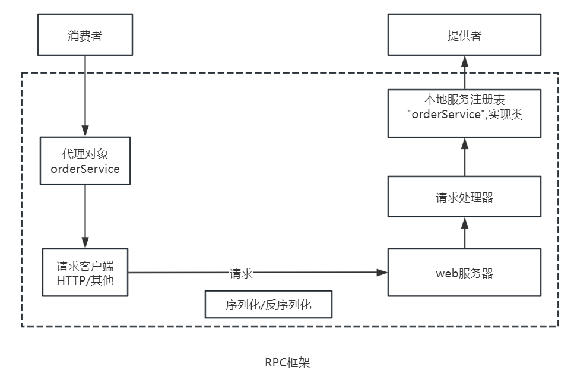

# lhl_RPC
从0到1，手写开发RPC框架

#### RPC基本概念
RPC即远程过程调用，是一种计算机通信协议，它允许程序在不同的计算机之间进行通信和交互，像本地调用一样。

RPC允许一个程序（服务消费者）像调用自己程序的方法一样，调用另一个程序（服务提供者）的接口，而不需要了解数据的传输处理过程、底层网络通信的细节等。这些都会由RPC框架帮你完成，使开发者可以轻松调用远程服务。

#### RPC框架架构图

### 扩展设计

